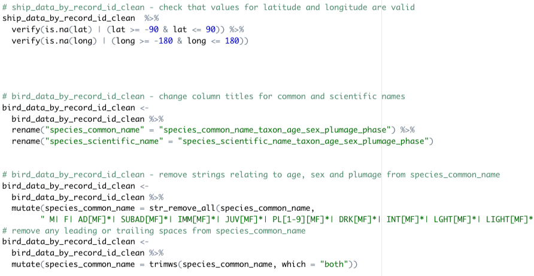
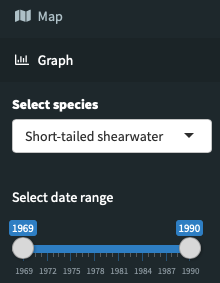
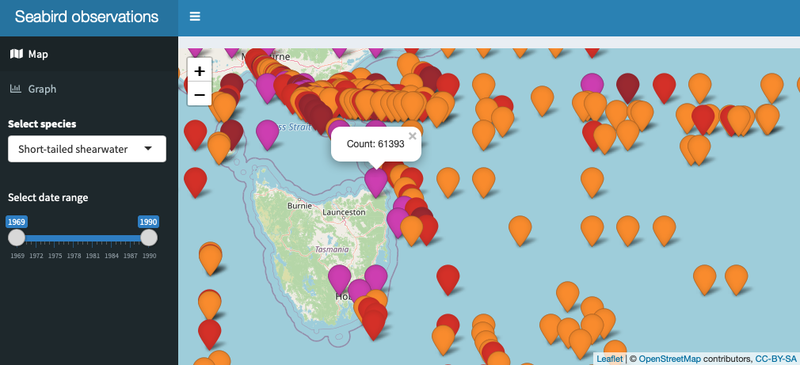
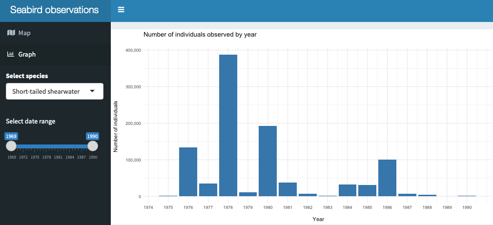

# Shiny dashboard app using leaflet map and ggplot chart

Live version available here: https://neilecosse.shinyapps.io/seabird_data/

## Overview

This project uses seabird observation in a dashboard which displays the information on a map and in a chart.

## Process Methodology

I imported the raw Excel files into an R Studio project, and created an R script to clean them.

The cleaning file is saved in the **scripts** folder:

After investigating the data, I coded a Shiny dashboard which allows you to select a species and date range to be shown on the map and graph.

## Packages Used

The main packages used for cleaning and analysis were **tidyverse**, **janitor** and **assertr**. I then created the app using **shinydashboard**, along with **leaflet** for the map and  **ggplot** for the graph.

## App features 

### Sidebar - menu and inputs

Here you can choose whether you want to view the map or the graph, and select the species and date range yopu want them to show.

### Map

The map shows observations for the selected species and date range.

Clicking on an observation will show you the number of individuals observed; deeper colours indicate higher numbers of individuals.

### Graph

The map shows the total number of individuals observed by year for the selected species and date range.

